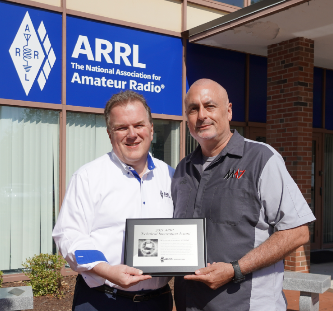
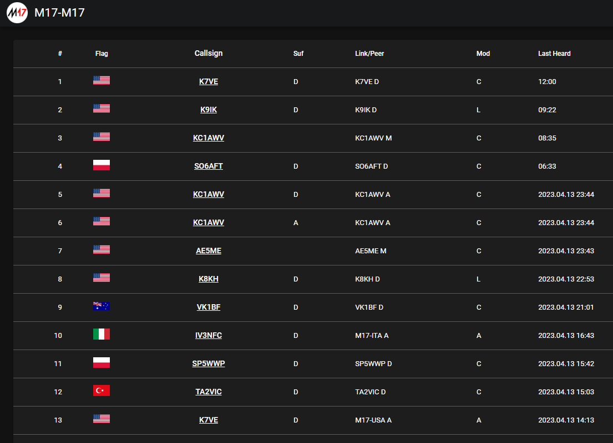
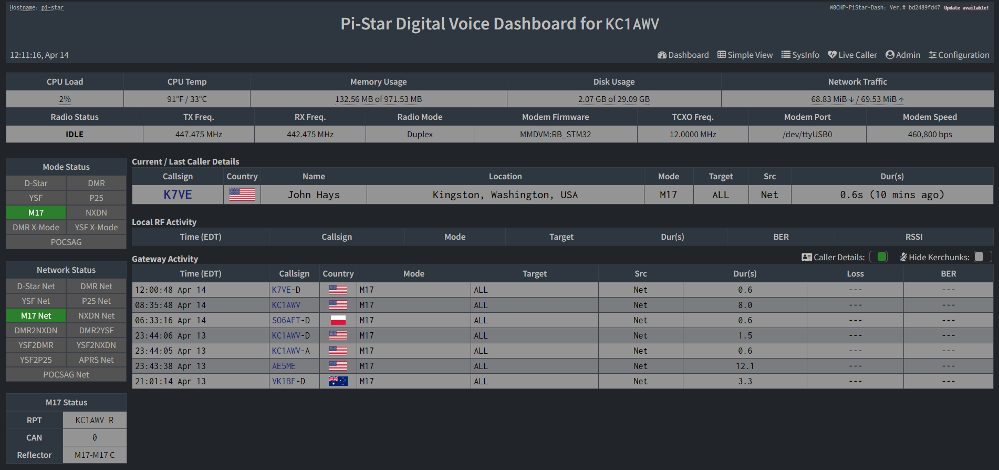
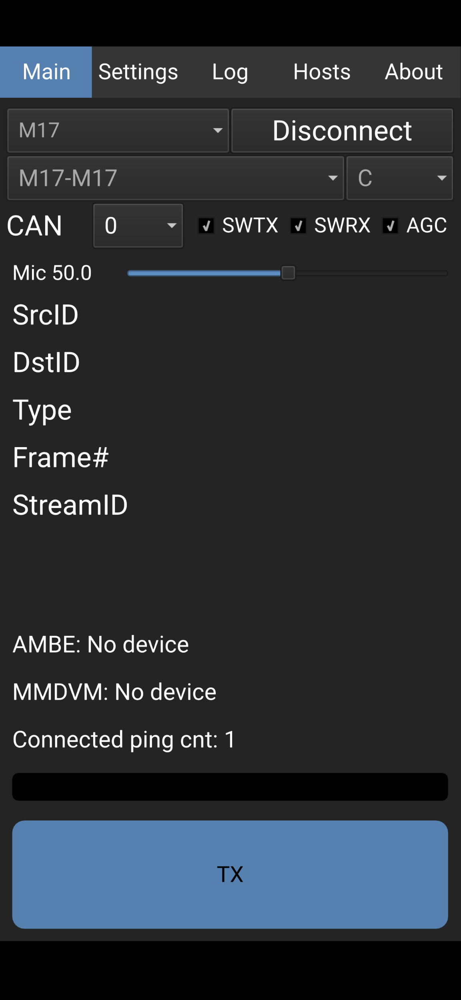
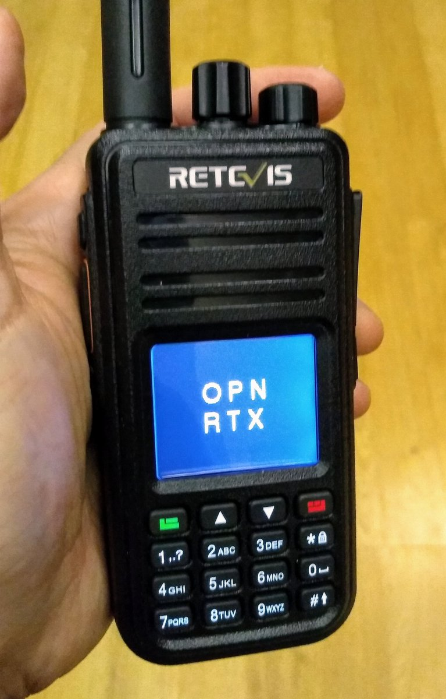
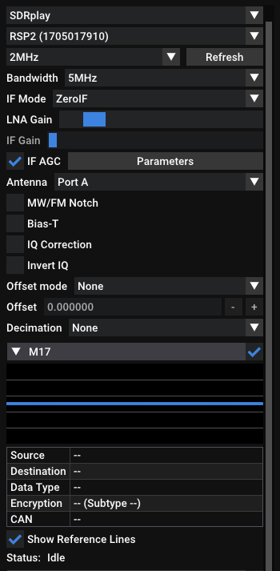
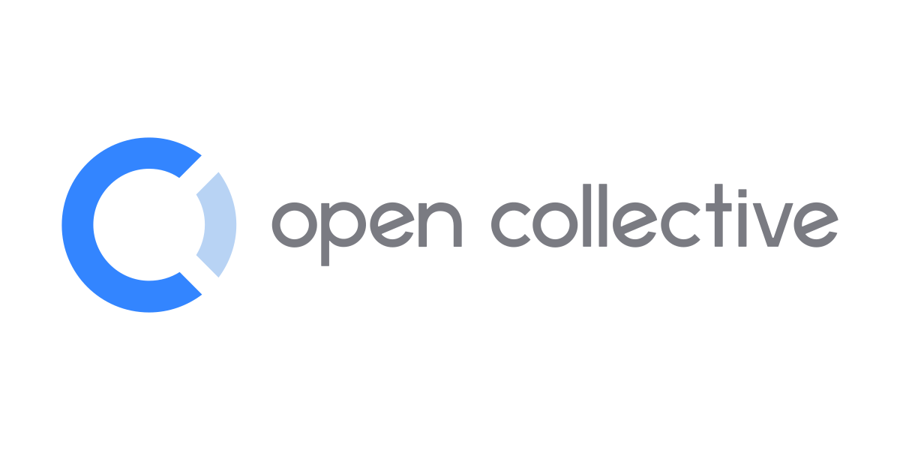

<style>
  :root {
    --color-background: #333;
    --color-foreground: #fff;
    --color-highlight: #f96;
    --color-dimmed: #888;
  }
</style>

<!-- _class: lead -->


# M17 Project
Open Source Amateur Radio

---

# What is M17?

From the M17 Project website: https://m17project.org

> M17 is a community of open source developers and radio enthusiasts. We're building understandable systems in support of the hackers and experimenters' history of ham radio.

Existing VHF/UHF DV modes are mostly derived from commerical or public service standards (DMR, P25), are proprietary (Fusion) or are mostly open with proprietary components (D-Star). The vocoder in all of these modes is a proprietary AMBE/IMBE variant from DVSI.

---

# M17 Application Features

Fully open source hardware and software, including the Codec 2 vocoder. Specification is available at https://spec.m17project.org

Built by a global team of amateurs

9600 bps 4FSK modulation (4800 symbols/sec)

Codec 2 at 3200 bps (voice only), or Codec 2 at 1600 bps (mixed voice and data)

No callsign database needed

---

# M17 Application Features

Short message support (SMS)

File Transfer support (Packet Mode)

GPS location reporting and APRS integration

_Optional_ strong encryption

Simplified reflector operation and callsign routing

Manufacturer agnostic - can be implemented by any capable platform

---

# History

M17 started in Warsaw, Poland, by Wojciech Kaczmarski SP5WWP while he was a member of the SP5KAB radio club

After experimenting with existing DV modes, Wojciech deceded to create a different mode, now called M17. The name is derived from the address of the SP5KAB radio club, Mokotowska 17

Now, four years later, a global team has contributed to M17 hardware and software, testing, publicity, and maintenance of infrastructure

---

# ARRL Technical Innovation Award

> The 2021 ARRL Technical Innovation Award honors Wojciech Kaczmarski, SP5WWP, for developing a new digital radio communication protocol, M17, for the good of amateur radio. 



```
Pictured: ARRL CEO David Minster NA2AA (left) and M17 Community Manager Ed Wilson N2XDD (right)
Photo credit: Alex Norstrom KC1RMO
```
---

# Development


M17 is under very active development. Many parts of the M17 ecosystem are currently available:

- Reflector
  - mrefd by Tom N7TAE
  - IPv6 capable
  - No callsign database needed

---

# Development


M17 is under very active development. Many parts of the M17 ecosystem are currently available:

- Repeaters and Hotspots
  - MMDVM by Jonathan G4KLX
  - MMDVM_HS by Andy CA6JAU
  - WPSD by Chip W0CHP

---

# Development


M17 is under very active development. Many parts of the M17 ecosystem are currently available:

- Internet clients
  - mvoice by Tom N7TAE
  - M17Client by Jonathan G4KLX
  - DroidStar by Doug AD8DP

---

# Development


M17 is under very active development. Many parts of the M17 ecosystem are currently available:

- Radio modems
  - Module 17 by Mathis DB9MAT
  - Opi17 by Pedro M0IEI
  - TNC4 by Mobilinkd (WX9O)

---

# Development


M17 is under very active development. Many parts of the M17 ecosystem are currently available:

- Radios
  - OpenRTX (TYT MD series / Retevis RT series)
  - OpenHT
  - SA8x8 modules (very experimental)

---

# Development


M17 is under very active development. Many parts of the M17 ecosystem are currently available:

- SDR
  - SDR++ by Alexandre ON5RYZ
  - Openwebrx by Jakob DD5JFK
  - Rpitx by F0OEO
  - GNURadio (gr-m17)

---

# Get Involved

M17 is a community that thrives on volunteer participation

Community Aspects:

- Software and hardware development
- Testing
- Publicity and Communication
- 3D CAD and printing
- Operating

---

# Getting on Air
## Internet

- mvoice
  - Linux client
  - Runs on Raspberry Pi
  - Use your own headset

---

# Getting on Air
## Internet

- DroidStar
  - Android app from Play Store
  - Linux available by compiling source
  - iOS was available
  - Windows via obscure build

---

# Getting on Air
## Internet

Cross-mode tools are available through the work of AD8DP

- USRP2M17
- DMR2M17
- M172YSF
- DVSwitch - Analog Reflector

---

# Getting on Air
## RF

Capability of transceiving M17 over RF _is_ possible, now!

MMDVM hotspots and modems can be upgraded to support M17 using MMDVM(_HS) v1.6.0+

Must use updated MMDVMHost and M17Gateway on PiStar, or use WPSD by Chip W0CHP

---

# Getting on Air
## RF

M17 Modem implementations:

- M17Client by Jonathan G4KLX
  - Linux client (also runs on RPi)
  - Uses existing MMDVM Modems and Hotspots
  - Must compile and configure yourself
    - Documentation needed!

---

# Getting on Air
## RF

M17 Modem implementations:

- TNC4 by Mobilinkd
  - Any KISS capable software
  - M17HT Android App
  - Must use 9600 baud capable radio

---

# Getting on Air
## RF

Partial (RX only)

- SDR++ by Alexandre ON5RYZ
  - Builtin M17 decoder
- Openwebrx by Jakob DD5JFK
  - Optional M17 decoder

---

# Getting on Air
## RF

Partial (TX only)

- rpitx
  - Transmits baseband M17 from a Raspberry Pi via GPIO pin

---

# Getting on Air
## RF

TX/RX

- OpenRTX
  - TX and RX work, with modifications to specific radios
- Module 17
- OpiM17
- M17AnalogGateway

---

# Getting on Air
## RF

TX (soon, RX)

- m17-tools derived from m17-cxx-demod
  - Works with DigiRig
  - Runs on Windows!

---

# Grants, Sponsors, and Partners


Grants from ARDC
- April 2021, granted $250,000 for research and development
- December 2022, granted $228,900 to DARC for M17 development

---

# Grants, Sponsors, and Partners


OCF Fiscal Sponsor
- Provides all benefits of a 501(c)(3) non-profit with fiscal support
- Donations to M17 accepted through OCF

---

# Grants, Sponsors, and Partners

OpenRTX
- Develops firmware with M17 support for many radio platforms

Ettus Research
- Provided hardware for RF research and development

ZUMRadio
- Provided hardware to support M17 development on hotspot and modem platforms

---

# More Information

M17 Project https://m17project.org
OpenRTX https://openrtx.org
Open Collective https://opencollective.com/m17-project

M17 Project Net on Fridays at 1700 UTC
- Reflector M17-M17 Module C

Discord https://discord.gg/G8zGphypf6
Matrix https://matrix.to/#/#m17project:matrix.org